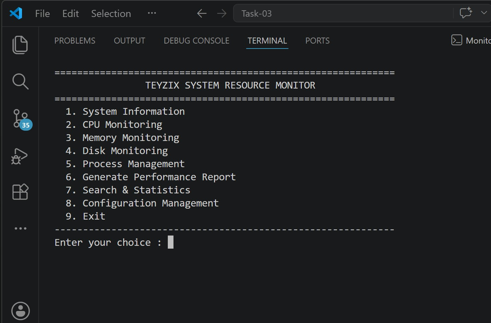
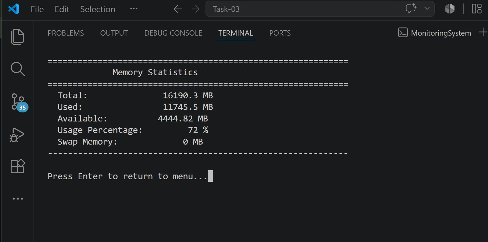
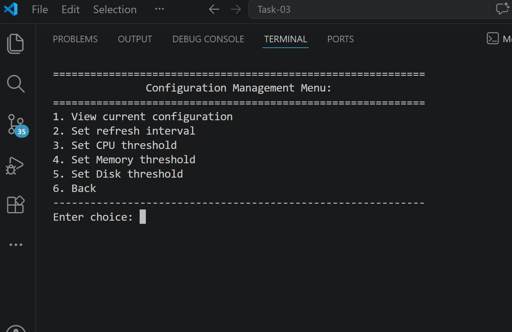
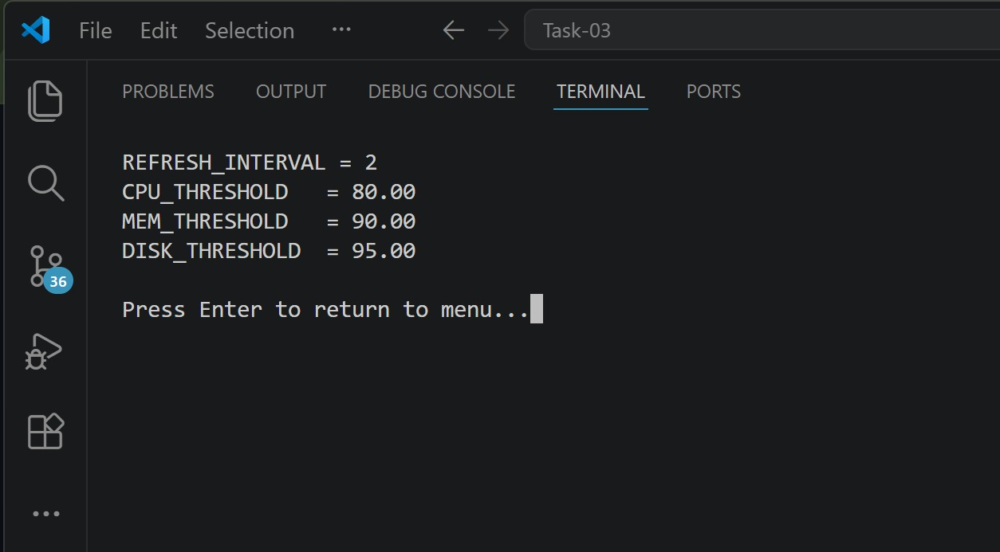
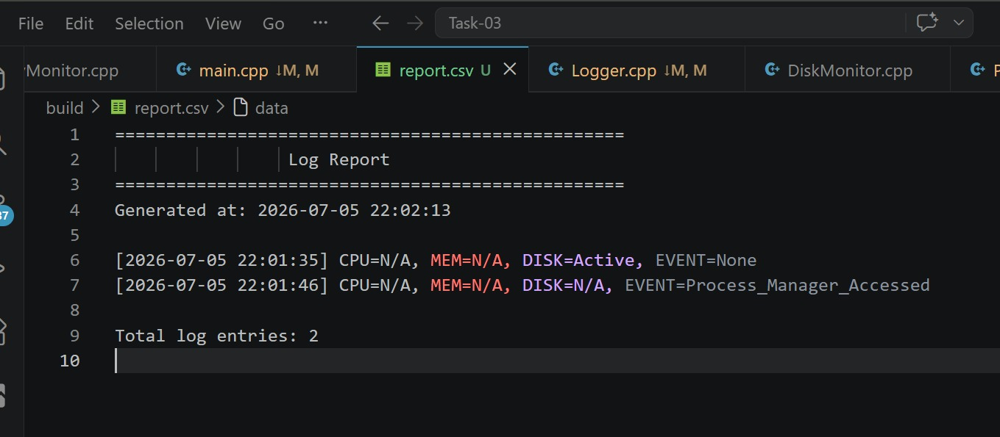

# 🖥️ Monitoring System

A C++ terminal-based system monitoring tool that monitors CPU, memory, and disk usage, raises alerts based on thresholds, and generates logs/reports.

---

## ✨ Key Features

- Real-time monitoring of:
  - CPU usage
  - Memory usage
  - Disk usage
- Configurable thresholds (CPU/MEM/DISK)
- Configurable refresh interval
- Alert logging + report generation
- Menu-driven terminal interface
- Modular OOP architecture (`include/` + `src/`)

---

## 🧵 Multithreading Implementation (Important)

This project includes **multi-threaded monitoring** so multiple system metrics can be tracked concurrently instead of sequential blocking.

### Threading highlights:
- Separate monitoring flow for CPU, Memory, and Disk checks
- Periodic refresh controlled through configurable interval
- Better responsiveness than single-thread polling
- Design can be extended to producer-consumer logging / async reporting

### Why it matters:
- Reduces delay between metric updates
- Improves scalability for additional monitors
- Demonstrates practical concurrency in C++

---

## 🧱 Project Structure

```text
Monitoring-System/
├── include/
│   ├── BaseMonitor.h
│   ├── ConfigManager.h
│   ├── CpuMonitor.h
│   ├── DiskMonitor.h
│   ├── Logger.h
│   ├── MemoryMonitor.h
│   ├── ProcessManager.h
│   ├── SystemInfoMonitor.h
│   └── Utils.h
├── src/
│   ├── main.cpp
│   ├── ConfigManager.cpp
│   ├── CpuMonitor.cpp
│   ├── DiskMonitor.cpp
│   ├── Logger.cpp
│   ├── MemoryMonitor.cpp
│   ├── ProcessManager.cpp
│   ├── SystemInfoMonitor.cpp
│   └── Utils.cpp
├── CMakeLists.txt
├── config.txt
└── README.md
```

---

## ⚙️ Requirements

- C++17 compatible compiler
- CMake 3.10+
- Ninja/Make (optional)

---

## 🚀 Build & Run

### Windows (PowerShell)

```bash
mkdir build
cd build
cmake ..
cmake --build .
.\MonitoringSystem.exe
```

### Linux/macOS

```bash
mkdir -p build
cd build
cmake ..
cmake --build .
./MonitoringSystem
```

---

## 🛠️ Configuration

Configured through `config.txt` and runtime menu:

- `REFRESH_INTERVAL`
- `CPU_THRESHOLD`
- `MEM_THRESHOLD`
- `DISK_THRESHOLD`
- `MAX_LOG_SIZE_KB`
- `MAX_LOG_FILES`

---

## 📄 Logging and Reports

- Runtime alerts are written to log file
- Monitoring summary/report is generated in CSV format

---

## 📘 What I Learned

Through this project I learned:

- Designing a modular C++ application using header/source separation
- Using **CMake** for cross-platform build configuration
- Implementing **multithreading** for concurrent monitoring tasks
- Handling synchronization and runtime flow in terminal apps
- Managing configuration-driven behavior (thresholds/intervals)
- Debugging compile-time vs linker-time errors
- Using Git + GitHub workflow (commit, push, merge, publish)

---

## 🚀 How This Project Can Be Improved

Future improvements I can implement:

- Add thread-safe queue for centralized async logging
- Add mutex-protected shared data and cleaner thread lifecycle control
- Export JSON reports in addition to CSV
- Add unit tests for monitors and config parser
- Add dashboard-style UI (ncurses/GUI/web)
- Add per-process CPU/RAM tracking with alerts
- Add historical trend charts and anomaly detection
- Containerize with Docker for easier deployment

---

## 📸 Snapshots

> Add your screenshots in a folder named `snapshots/` in the repo, then link them below.

### Main Menu


### Live Monitoring Output


### Configuration Menu


### Alerts / Logs


### Generated Report

